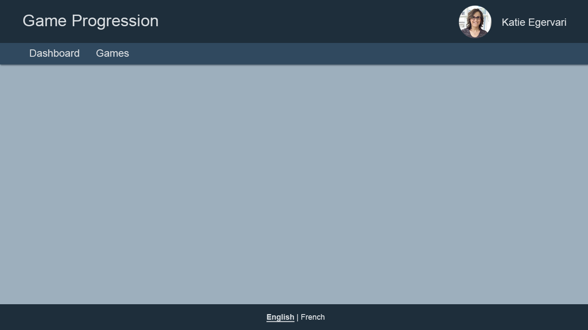

# App Layout

## Requirements

- Should have a header, body and footer
- Header
  - The title of the application
  - A my-profile button
  - A menu containing buttons for “Dashboard” and “Games”
    - The menu button should be highlighted if the user is on that page
- Body contains whatever the current route should display
- Route: `/`
- Unknown routes should go to `/`
- Footer
  - TODO:
  - A way to quickly set your language between English/French
  - The selected is bold and has an underline to indicate its selection

## Details

- APIs Required:

  - `GET /profile`: To retrieve the profile information for the header
  - `GET /languages`: To retrieve the list of languages for the footer

- TODO:
  - localization (language switching) can be finished later, setting the current language is fine for now.
