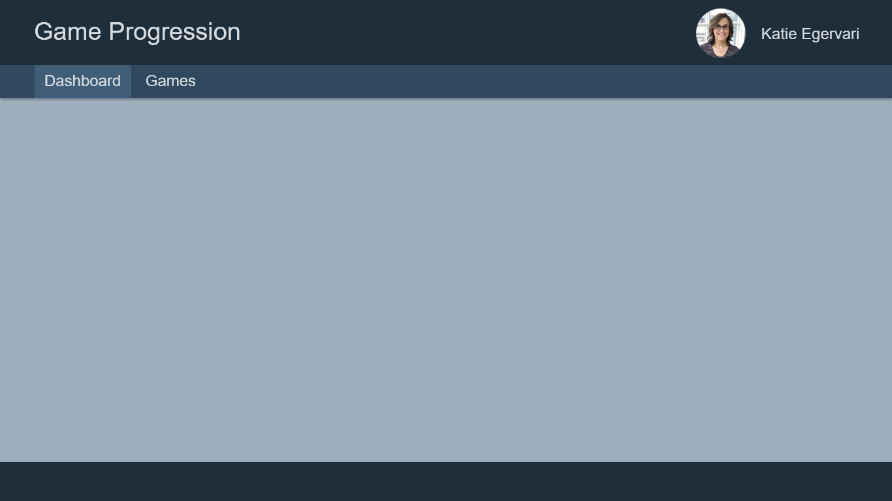

# App Layout

## Requirements

- Should have a header, body and footer
- Header
  - The title of the application
  - A my-profile button
  - A menu containing buttons for “Dashboard” and “Games”
    - The menu button should be highlighted if the user is on that page
- Body contains whatever the current route should display
- Route: `/`
- Unknown routes should go to `/`
- Footer
  - An empty coloured rectangle for now

## Details

- APIs Required:

  - `GET /profile`: To retrieve the profile information for the header
