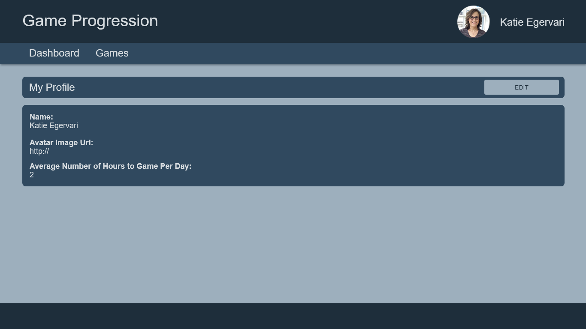

# View Your profile

## Requirements

- Route `/my-profile`
- See Profile Details
  - First and Last name
  - Avatar Image Url
  - Average Number of Hours to game per day
- Edit button that navigates to `/my-profile/edit`

## Details

- APIs Required:
  - `GET /profile`: To retrieve the profile information
