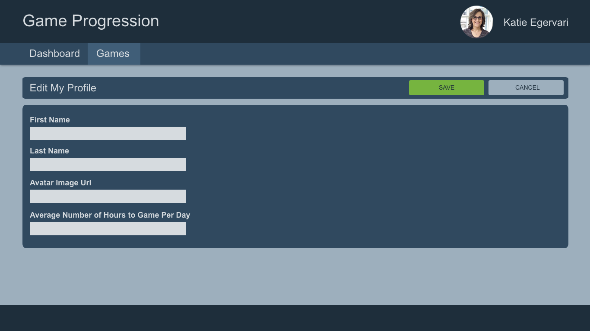

## Edit Your Profile

## Requirements

- Route: `/my-profile/edit`
- Form Fields
  - First and Last name.
    - Required
    - Only alphabet characters
  - Avatar Image Url
    - Required
  - Average Number of Hours to game per day
    - Required
    - Must be a number >= 0
  - Form should display error messages per each field and disable the save button until the
- Save and Cancel buttons
  - If the user presses cancel and the form is dirty (the names, avatar, or hours has been modified), show a modal dialog asking confirmation if they want to leave without saving changes

## Details

- APIs Required:
  - `PUT /profile`: To update the profile information
