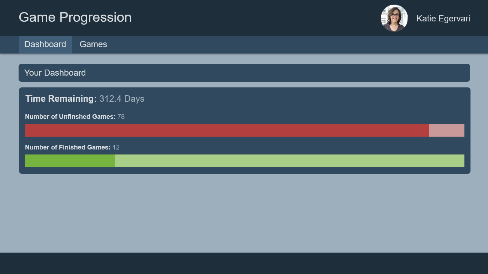

# Dashboard

## Requirements

- Route: `/dashboard`
- If the user goes to `/`, it should redirect to `/dashboard`
- 'Dashboard' link in navigation should navigate to dashboard and reflect when route is active
- Display the total number of days required for Katie to finish all her uncompleted games
  - Round to 1 decimal place
- Show a progress bar to illustrate the % complete of incomplete games out of the total number of games
  - Be sure to account for partial completion from this overall %
    - % complete of each unfinished game / number of total games
- Show a progress bar to illustrate the % complete of completed games out of the total number of games
  - Since completion is always 100%, it's just simple division
    - number of completed games / number of total games

## Details

- APIs Required:
  - `GET /games`: To retrieve the list of games to perform
