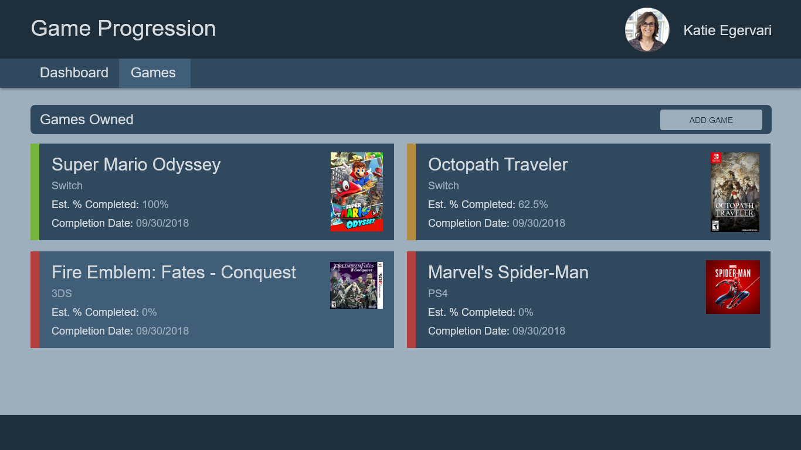

# Games

- Route: `/games`
- A card listing of all game entries, showing the following details:
  - If there are no games, display the message, "There are no games in the catalog."
    When implementing this, make use of `[ngSwitch]`.
- Card Details
  - The game name
  - The image of the game
  - A color indicator about completion somewhere on the card
    - Green for marked as completed.
      - If you want to add a material Icon too: `check_circle`
    - Orange when not completed and game progression is > 0 and <= 100%
      - If you want to add a material Icon too: `play_circle_filled`
    - Red when game is not completed and has 0% completion
      - If you want to add a material Icon too: `access_time`
  - Platform Name
  - Estimated % Complete
    - Note: Estimates cannot exceed 100%.
    - Calculated by hours played / hours to complete
    - Rounded off to 1 decimal place
  - Estimated Completion Date
    - Format: 09/30/2018
- Interactions
  - When hovering over a card, the background color should change and
    the cursor should be set to a pointer
    - The background color change should be a animated CSS transition of 200ms
  - clicking a card will navigate to /games/edit/:id
  - ADD GAME button will navigate to /games/add

## Details

- APIs Required:
  - `GET /games`: To retrieve the list of games to display the cards
  - `GET /platforms`: To map platform ID's to display platform names on games cards
