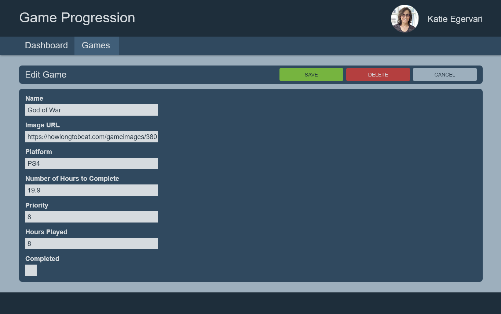

# Edit Game

## Requirements

- Route: `/games/edit/:id`
- Form Fields
  -- Name of game
  - Required
  - Image URL
    - Required
    - You don't have to upload an image here
      - I copy image addresses from https://howlongtobeat.com/
  - Platform
    - Can be a drop-down list or radio buttons - your choice
    - Platforms retrieved from REST
    - Placeholder Text: "Choose a platform..."
  - How many hours to complete game
    - Required
    - Must be a positive number
    - I grab the values from https://howlongtobeat.com/.
  - Priority between 1 and 10
    - Required
    - Placeholder Text: "Choose a priority..."
  - Hours Played
    - Default value = 0
    - Required
    - must a number >= 0
  - Completed
- Form should display error messages per each field and disable the save button until the

## Details

- APIs Required:
  - `GET /games`: To retrieve the games current properties as pre set form values
  - `GET /platforms`: To map platform ID's to display names on games cards
  - `PUT /games` to update an existing game
  - `DELETE /games` to remove a game
