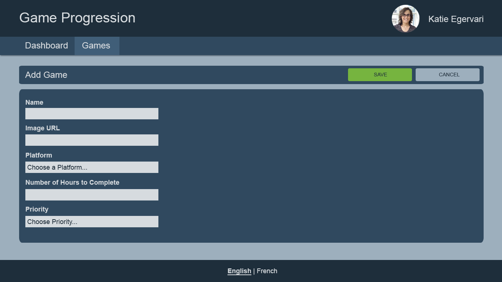

#### Add Game

- Route: `/games/add`
- APIs Required:
  - `GET /platforms`: To retrieve the list of platforms for the platform field
  - `POST /games`: To add a new game
- Form Fields
  - Name of game.
    - Required.
  - Image URL
    - Required
    - You don't have to upload an image here
      - I copy image addresses from https://howlongtobeat.com/
  - Choice of Platform
    - Can be a drop-down list or radio buttons - your choice
    - Platforms retrieved from REST
    - Placeholder Text: "Choose a platform..."
  - How many hours to complete game.
    - Required
    - Must be a positive number
    - I grab the values from https://howlongtobeat.com/.
  - Priority between 1 and 10
    - Required
    - Placeholder Text: "Choose a priority..."
  - Also track when the game was added before submitting a POST request. Make sure to save
    in ISO format with timezone information
