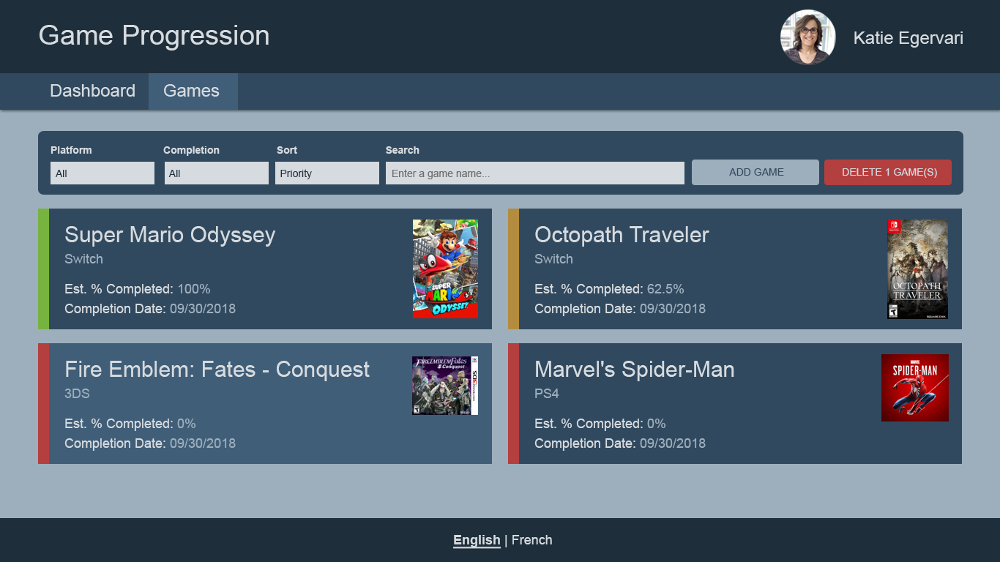

# Games Listing Filters

## Requirements

- Filters & Sorts
  - Changing any filter/sort value should immediately refresh the results
  - Filter By Platform
    - Select List containing all platforms from REST API
  - Filter By Completion
    - Select List containing 3 static values: All, Complete, Not Complete
  - Sort
    - Select List containing 3 static values: Priority, Completion % or Date Added
    - Default: sorted by Priority
  - Filter By Game name
    - Text Field
    - Debounce should be set to 250ms to prevent lots of API calls
      being made/cancelled as the user types
    - Placeholder Text: "Enter a game name"

## Details

- APIs Required:
  - `GET /platforms`: To display platforms as a filter option
